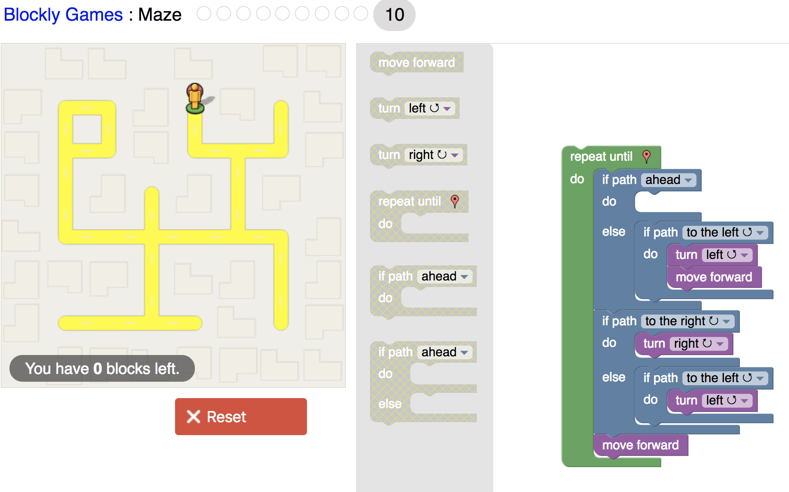
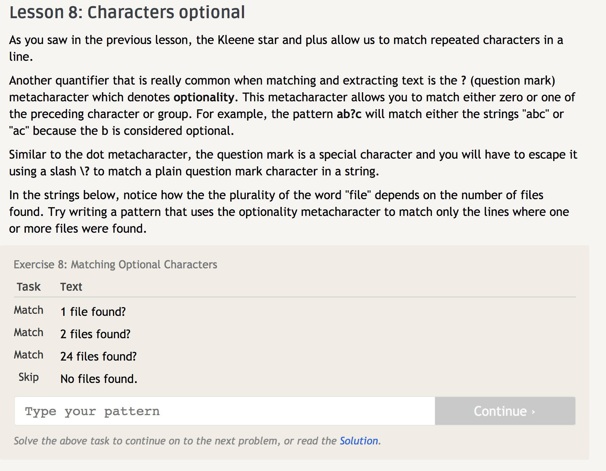

### Reading Assignment
1. Make sure that you understand the question before answering. 
2. Ask (politely) if the answer you gave helped the recipient. 

- This is a fantastic example of how broken the American Legal System is. It's the musical counterpart of a patent troll. This also just goes to show that as an open source developer you need to be careful how your software is used. Even if your intentions are good, you need to make sure that your community holds the same values as you and doesn't get you in trouble. 

### Blockly Solution
 
### Regex Solution
