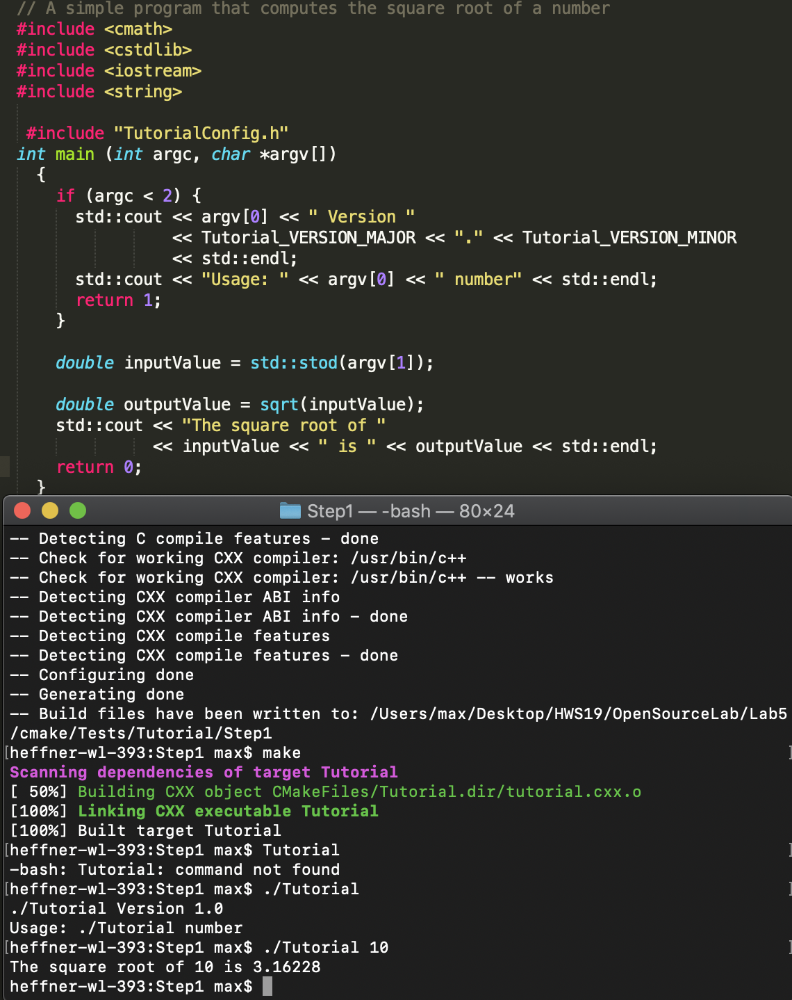
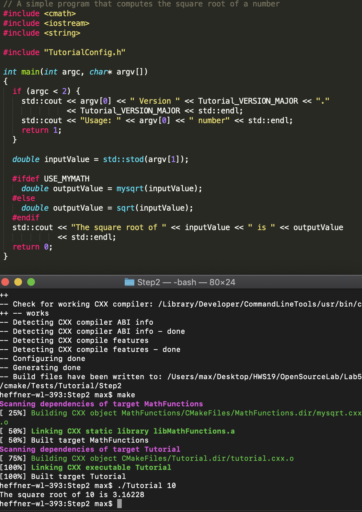
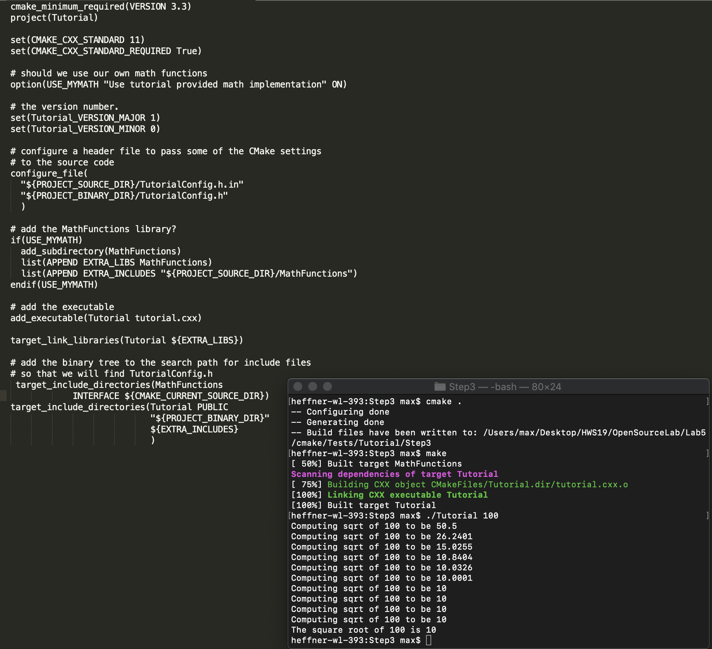
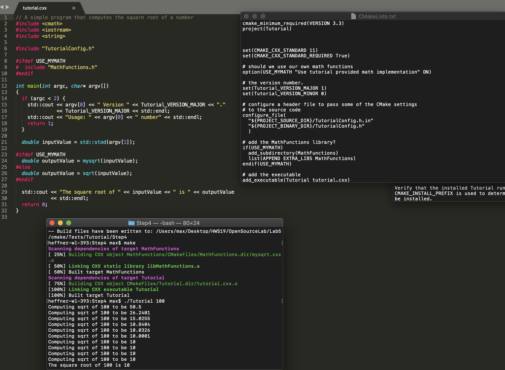
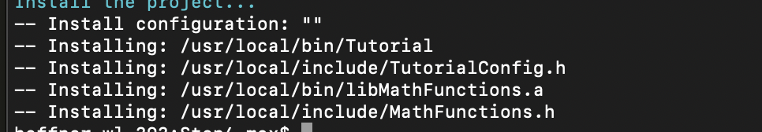
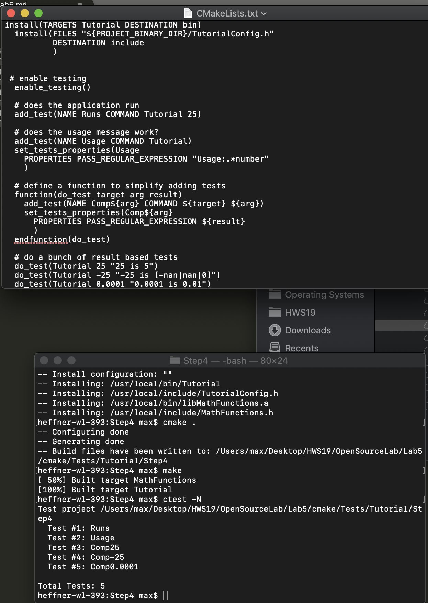
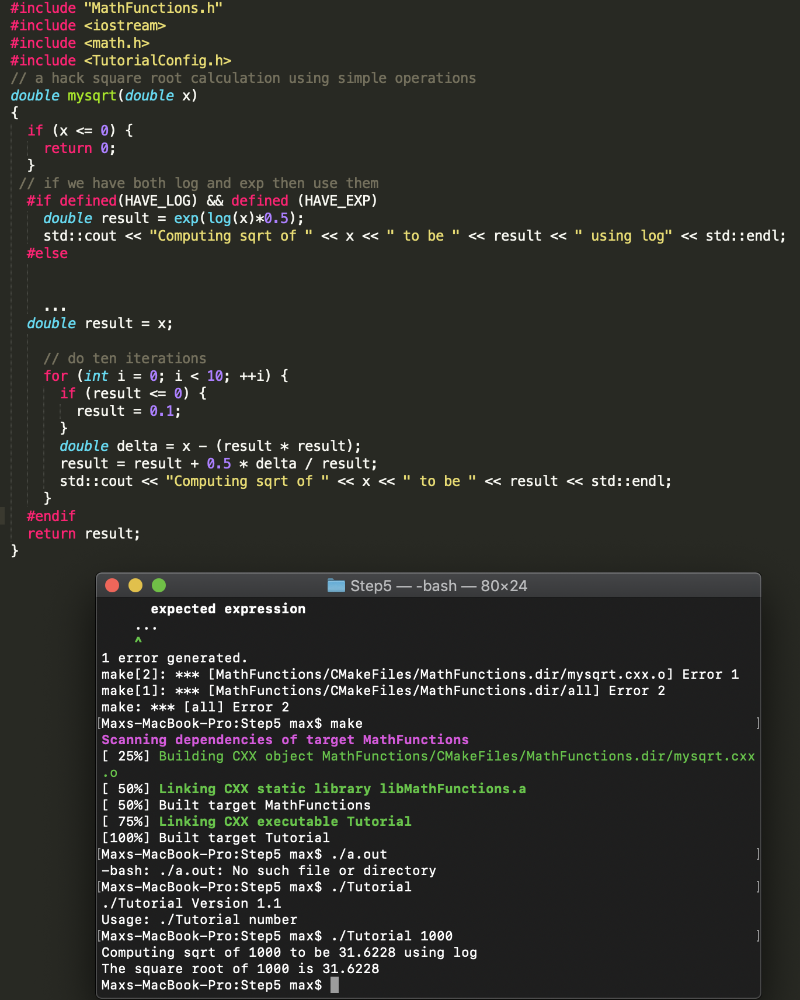

Lab 5

CMake Tutorial:
1. This step was just wrangling with CMake to run for the first time

2. This step taught me how to add a library to my source code and how to link it inside of CMake

3. This step shows us how to add in required dependancies for different files (consumers, producers)

4. This step is all about installing and testing, I learned how to create tests with regular expressions and install

5. Learning how to add Introspection to make sur ehte system has the required libraries and compilers necessary to make code
