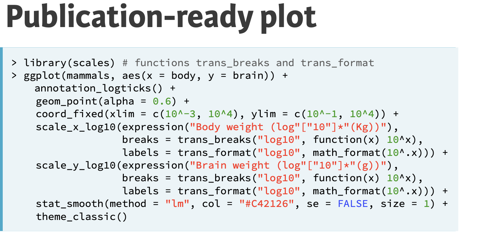
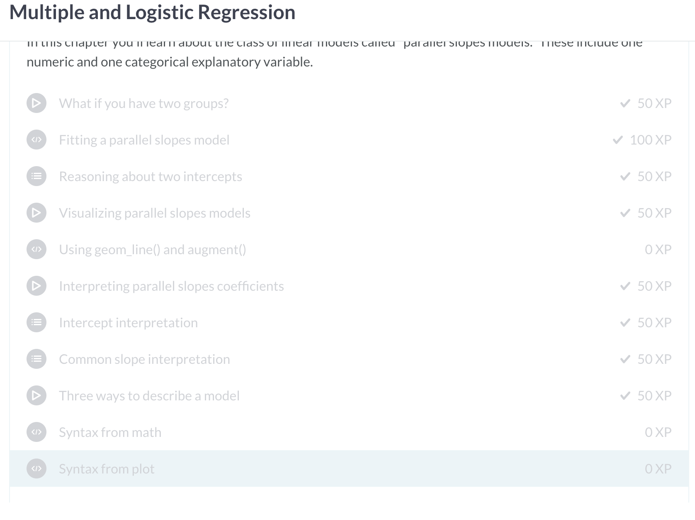

# Lab 7

3. 
- Data visualization for exploration vs. explanatory: Exploration is to determine patterns and confirm hypothesis, explanatory is to inform readers and convince them of your thesis
- Here is a publication ready plot 

- All exercises done

4.
- All exercises done

5. done
6. Our Open Source project: https://rcos.io/projects/meowskers/beirrun/profile