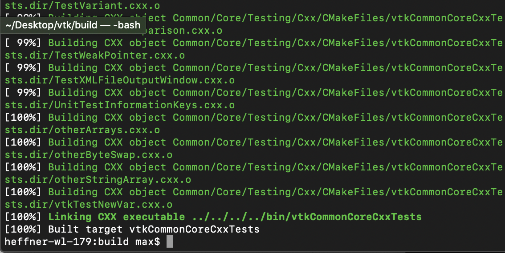
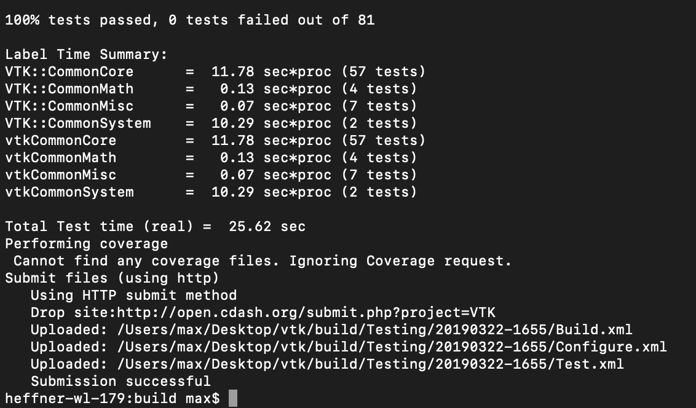
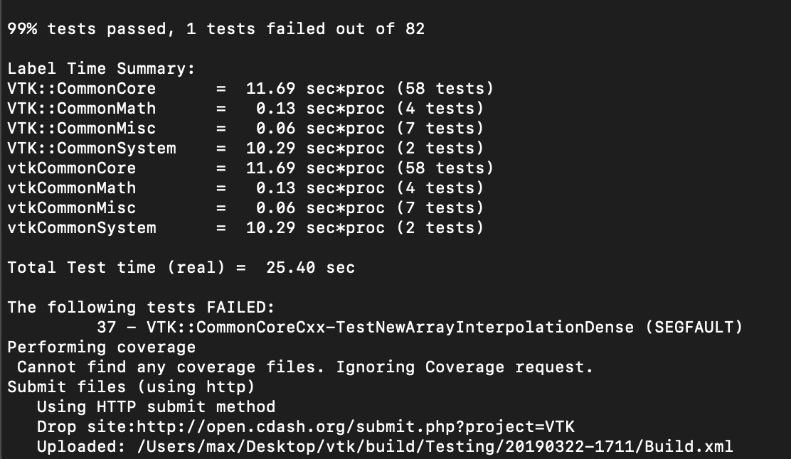
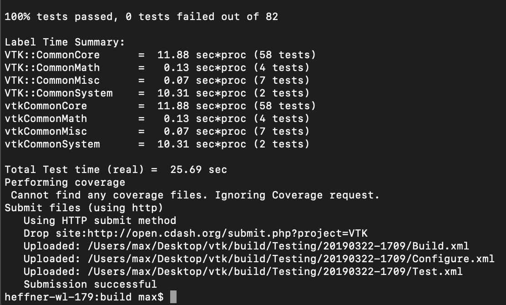

# Lab 8
1. 
2.
- Shows you on the left the site where the error occurred
- If you click on the error number it brings you to the details of the error
- No errors
- 
3. 
- 
4. The error was in the "Error expected 2" the equal check needed to be changed from 4 to 2
- 